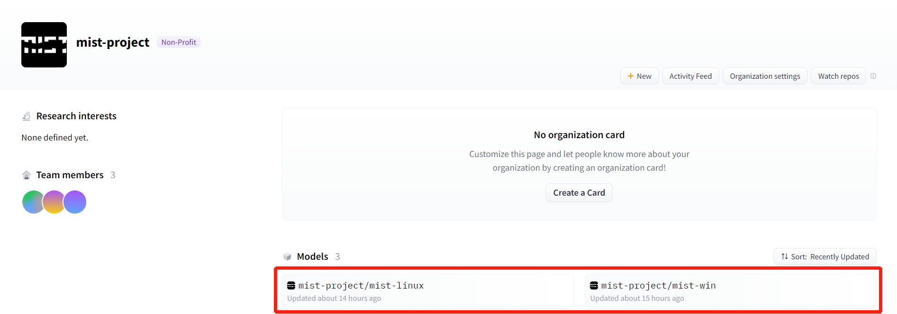
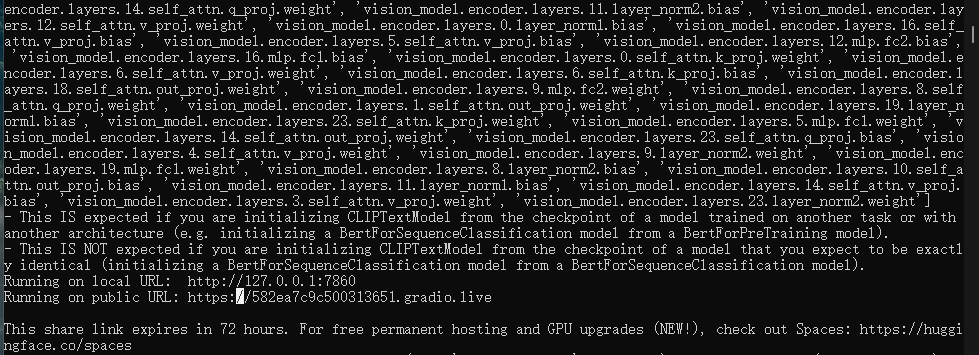
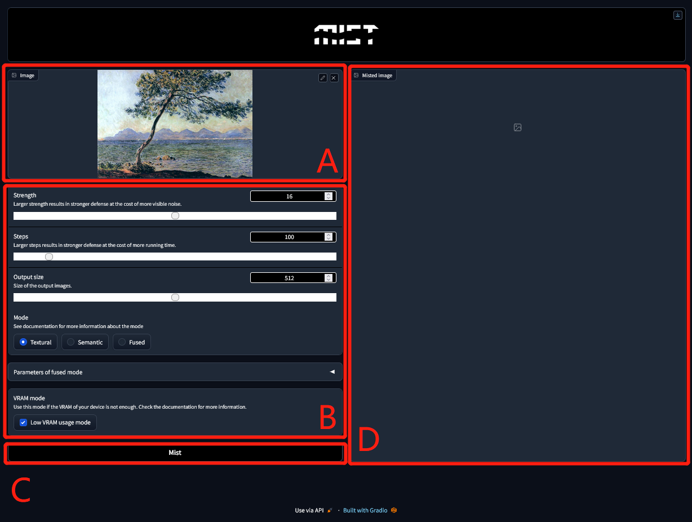
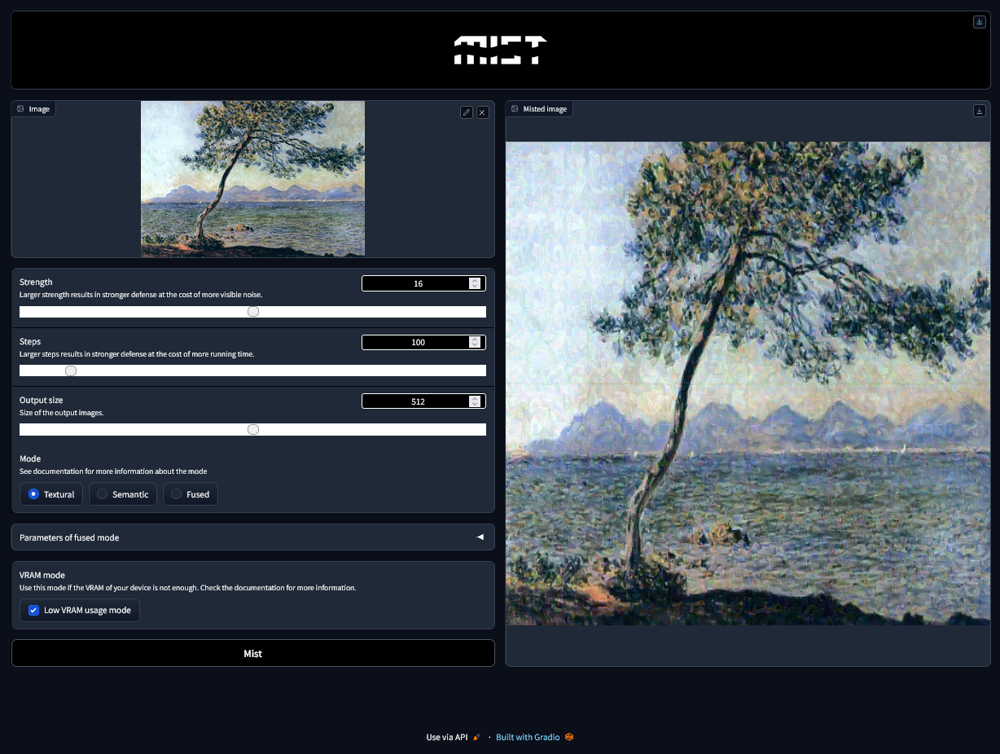

快速上手指南
*****************

安装
=======================

Mist支持Windows和Linux操作系统。Windows和Linus系统的Mist安装文件均可在 `Huggingface <https://huggingface.co/mist-project>`_ 上获取。 

要安装Mist，请选择与您的计算机系统相符的Mist project。我们以Windows系统为例介绍随后的安装步骤。首先，左击项目名称。

\

•	访问项目页面中的“Files and versions”，找到压缩文件。左击压缩文件。

.. image:: ../media/fig-quickstart-2.png
   :align: center
   :alt: fig_cbscenario

\

左击“download”。压缩文件将开始下载。

.. image:: ../media/fig-quickstart-3.png
   :align: center
   :alt: fig_cbscenario

\

压缩文件下载完成后，解压缩文件并访问“mist-webui-v1.0-win-release”目录。现在您已完成Mist的安装。要启动Mist，请左击“mist-webui.exe”。

使用
=======================

左击“mist-webui.exe”，您将看到一个命令提示符窗口。请等待几分钟，直到出现以下提示：

\

复制命令提示符中的链接（以上图为例，http://127.0.0.1:7860）并粘贴到浏览器中。Mist的工作页面将出现。
如果您在尝试将Mist部署为在线服务，您的用户可以通过图中的公共链接访问您的服务UI。

.. image:: ../media/fig-quickstart-4.png
   :align: center
   :alt: fig_cbscenario

\

Mist的工作页面包含四个不同的区域，在下图中分别标记为A、B、C和D。使用Mist添加水印需经过四个步骤。首先，左击A选择要添加水印的图像。其次，调整B中的参数，并选择合适的模式。关于模式选择，请参照文档中的“模式与参数”部分。
第三，左击C中的“Mist”按钮，启动添加水印的过程。第四，在几分钟后，您可以在D中下载带有水印的图像。

\

\

